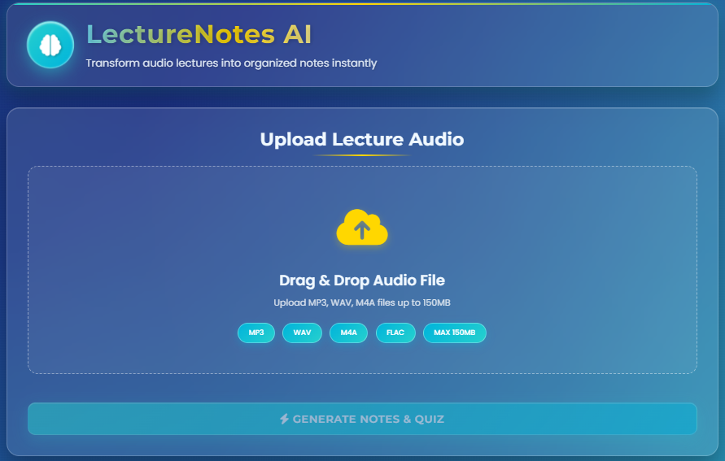
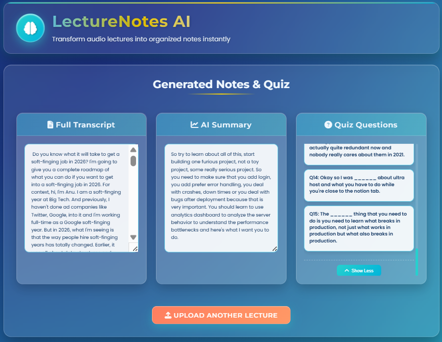

# 1. **LectureNotes AI: Voice-to-Notes Generator**  

**An AI-powered tool that converts audio lectures into structured notes, summaries, and quizzes in seconds**  

## 2. **Short Description/Purpose**  
This project solves a core student problem: it's nearly impossible to listen actively and take detailed notes simultaneously. **LectureNotes AI automates this by**:  
- 🎧 **Converting** spoken lecture audio into accurate text  
- 📝 **Summarizing** key points into clear, study-ready notes  
- ❓ **Generating** interactive quizzes to test understanding  

The goal is to help students capture **every important concept** without the stress of missing information during live lectures.

## 3. **Tech Stack**  
| Component | Technology Used |
|-----------|----------------|
| **Backend Framework** | Python, Flask |
| **Speech-to-Text Engine** | SpeechRecognition, Google Web Speech API |
| **AI Processing Logic** | Custom rule-based summarization & quiz generation |
| **Frontend** | HTML5, CSS3, Vanilla JavaScript |
| **Audio Processing** | Pydub, FFmpeg |
| **UI/UX Design** | Custom CSS with ocean-themed gradients & animations |
| **Deployment** | Local server (Flask) |

## 4. **Data Flow & Processing**  
**Input:** Audio files (MP3, WAV, M4A) from student lectures  
**Step 1 – Upload:** User drags/drops file into browser (max 150MB)  
**Step 2 – Transcription:** Backend converts audio to text using speech recognition  
**Step 3 – AI Analysis:**  
   - **Summarization:** Extracts key sentences based on importance scoring  
   - **Quiz Generation:** Creates fill-in-the-blank questions from key terms  
**Step 4 – Output:** Three-panel dashboard with **Transcript**, **Summary**, and **Quiz**

## 5. **Features/Highlights**  
### **📊 Key Metrics Displayed**  
✅ **Full Transcript** – Complete text conversion of the lecture  
✅ **AI Summary** – Concise overview of main points (rule-based/transformer-based)  
✅ **Interactive Quiz** – 10-15 fill-in-the-blank questions per lecture  
✅ **Real-time Processing** – Visual progress bar during audio analysis  

### **⚙️ Technical Capabilities**  
🔊 **Audio Support:** MP3, WAV, M4A, FLAC formats  
🧠 **Smart Blank Selection:** Avoids common words, selects meaningful terms for quizzes  
📱 **Responsive UI:** Works on desktop & mobile with ocean-themed design  
📈 **Progress Tracking:** Step-by-step feedback during processing  

### **👨‍🎓 User Workflow**  
1. **Upload** lecture audio via drag-and-drop  
2. **Watch** real-time processing progress  
3. **Access** three organized panels:  
   - 📄 **Transcript** for full reference  
   - 📝 **Summary** for quick review  
   - ❓ **Quiz** for self-testing  
4. **Toggle** quiz answers with click interaction  

### **🚀 Performance Features**  
⚡ **Chunked Processing:** Handles long lectures by splitting audio  
⚡ **Optimized Conversion:** FFmpeg ensures fast MP3-to-WAV conversion  
⚡ **Smart Question Generation:** Scores sentences for quiz-worthiness  
⚡ **Uniform Layout:** All output panels have consistent, scrollable design  

## 6. **Sample Input/Output**  
### **Input:**  
18-minute Computer Science lecture on *"Machine Learning Basics"* (MP3)  

### **Output:**  
#### **Transcript:**  
2,800-word accurate text of the entire lecture  

#### **Summary:**  
*"Machine learning enables computers to learn from data without explicit programming. Three main types exist: supervised (labeled data), unsupervised (pattern finding), and reinforcement (reward-based) learning. Neural networks mimic the brain's structure for deep learning tasks."*  

#### **Quiz Questions:**  
1. **"______ learning uses labeled data to train models for predictions."**  
   **Answer:** Supervised  
2. **"Neural networks are inspired by the structure of the human ______."**  
   **Answer:** brain  
3. **"When a model performs well on training data but poorly on new data, it's called ______."**  
   **Answer:** overfitting  

## 7. **Setup & Installation**  
### **Prerequisites:**  
- Python 3.8+  
- FFmpeg installed and added to PATH  

### **Steps:**  
1. **Clone repository:**  
   ```bash
   git clone https://github.com/ThisAkshat/lecture-notes-ai.git
   cd lecture-notes-ai
   ```  
2. **Install dependencies:**  
   ```bash
   pip install -r requirements.txt
   ```  
3. **Run the application:**  
   ```bash
   python app.py
   ```  
4. **Open browser to:** `http://localhost:10000`  

## 8. **Screenshots:**






